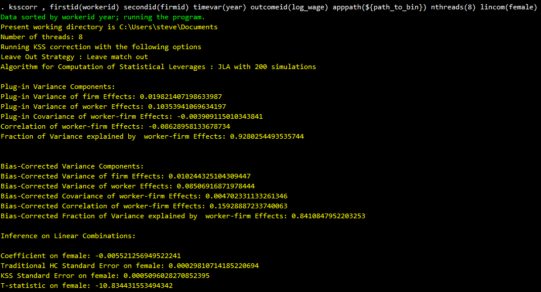

# KSSCORR: Variance Components Bias Correction in Two-Way FE Models based on Kline, Saggio, Soelvsten (2020)

- Jump to: [`description`](#description) [`citation`](#citation) [`install`](#install) 

-----------

## Description

`ksscorr` is a [Stata](http://www.stata.com/) wrapper of the Julia executable provided in the [VarianceComponentsHDFE.jl](https://github.com/HighDimensionalEconLab/VarianceComponentsHDFE.jl) package. It works by calling `inshell` (see [here](https://www.statalist.org/forums/forum/general-stata-discussion/general/1667486-new-package-inshell-available-on-the-ssc) for more details about this command) and running the routine based on the Stata options provided. The output of the Julia routine will be printed in the Stata window, and we provide an option to add the output of the Julia routine to the current dataset. The output from the Julia routine is:

- An indicator of whether the observation belongs to the leave-out connected set.
- The statistical leverages, referred to as Pii. These can be used to construct leave-out variances of the outcome.
- Variables related to the bias-correction routine, referred in the paper as Bii.
- Extremely fast estimation of the two-way fixed effects model. It uses an approximate Cholesky solver based on [Laplacians.jl](https://github.com/danspielman/Laplacians.jl).

You can check the new version additions [here](https://github.com/HighDimensionalEconLab/VarianceComponentsHDFE.jl/releases).

-------------

## Example of command output 

 


####  Things to be aware of:

- `ksscorr` depends on the `inshell` package and you need to *manually* download and unzip the [Julia app](https://github.com/HighDimensionalEconLab/VarianceComponentsHDFE.jl/releases/tag/v0.2.1.8) based on your operating system. The path to the bin folder is a required argument in the `ksscorr` command.
- Hasn't been thoroughly tested yet in MacOS and Unix systems. Please post any issues in the Github repository page.

#### Future updates

- Add the postestimation inference (lincom) part of the Julia routine.

## Citation

`ksscorr` implements the estimator described in [Kline, Saggio and S\olvsten (2020)](https://eml.berkeley.edu/~pkline/papers/KSS2020.pdf).
If you use it, please cite the paper:

```bibtex
@Article{Kline&Saggio&Soelvsten@ECTA2020,
  author  = {Kline, Patrick and Saggio, Raffaele and S\olvsten, Mikkel },
  journal = {Econometrica},
  title   = {Leave-out Estimation of Variance Components},
  year    = {2020},
  pages   = {1859–1898},
  volume  = {88},
}
```

## Install:

As mentioned before, `ksscorr` depends on the `inshell` package. To install it, run the following lines:

```stata
* Install inshell 
ssc install inshell
```

You need to manually download and unzip the [Julia app](https://github.com/HighDimensionalEconLab/VarianceComponentsHDFE.jl/releases/tag/v0.2.1.8) based on your operating system. The path to the bin folder is a required argument in the `ksscorr` command.

Next, you can run 

```stata
* Make sure to install the latest version
cap ado uninstall ksscorr
net install ksscorr, from("https://raw.githubusercontent.com/paulcorcuera/ksscorr/master/src/")
```

Otherwise, you can use the "Download Zip" button above, unzip it to a local directory, and then replace the above net install with
```stata
net install ksscorr, from(full_local_path_to_files) replace
```
where the path has to lead to the ado and sthlp files.
